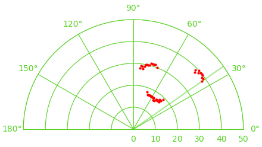

# Arduino Radar System

Code for a simple radar setup using an Arduino UNO, HC-SR04 ultrasonic sensor, SG90 
servo motor, and DHT11 temperature and humidity sensor.

<h1 align="center">
    
</h1>

## Table of Contents
* [Installation](#installation)
* [Usage](#usage)
* [Troubleshooting](#troubleshooting)
* [Additional Things to Read](#additional-things-to-read)

## Installation

First, the necessary Arduino libraries should be installed:
- [https://github.com/arduino-libraries/Servo](https://github.com/arduino-libraries/Servo)
- [https://github.com/adafruit/DHT-sensor-library](https://github.com/adafruit/DHT-sensor-library)  

Both of these libraries can be found in the Arduino IDE's Library Manager under 
`Sketch > Include Library > Manage Libraries...`.

Next, the necessary Python libraries should be installed:
- [NumPy](https://anaconda.org/conda-forge/numpy)
- [Matplotlib](https://anaconda.org/conda-forge/matplotlib)
- [PySerial](https://anaconda.org/conda-forge/pyserial)
- [Pandas](https://anaconda.org/conda-forge/pandas)

The Anaconda distribution of Python was used to install these libraries.
```
conda install -c conda-forge numpy pandas matplotlib pyserial
```

## Usage

### Calibration

Before using the radar, calibration should be done to find the speed of sound in the 
environment you are in. The code is setup to do this in two ways:

1. **Distance-Time Method**  
    Setup the ultrasonic sensor a set distance away from a flat surface and measure the 
    time it takes for a ultrasonic wave to return. Dividing the distance by the time 
    returns the sound speed.

2. **Atmospheric Method**  
    Calculate the speed of sound based off of ambient conditions including temperature, 
    relative humidity, pressure, and CO2 concentration.

The data for these methods is recorded at the same time. Set your ultrasonic sensor a 
known distance away from a flat surface. Change the distance parameter in the 
`calibration.ino` file to reflect your setup. Upload the `calibration.ino` file to your 
Arduino and run `calibration.py` on your computer. This will record the temperature, 
relative humidity, and speed of sound every two seconds while running. Press `CTRL+C` 
to stop the program and print the mean values of the session. You can use the speed of 
sound displayed at this point, or a more accurate speed of sound can be calculated 
following the [instructions](./calibration/calibration.md) in the calibration folder.

### Radar

Once the speed of sound is obtained, update the value in the `radar.ino` file, then 
upload it to your Arduino. Run the `radar.py` file on your computer to start requesting 
data from the Arduino. It will be plotted in real-time in the popup graphical interface.

## Troubleshooting

On Linux, one possible issue may be that you do not have permission to read the
`/dev/tty*` ports. I found that following [this](https://askubuntu.com/questions/210177/serial-port-terminal-cannot-open-dev-ttys0-permission-denied)
answer and adding myself to the `dialout` group allowed me to read the files.

## Additional Things to Read